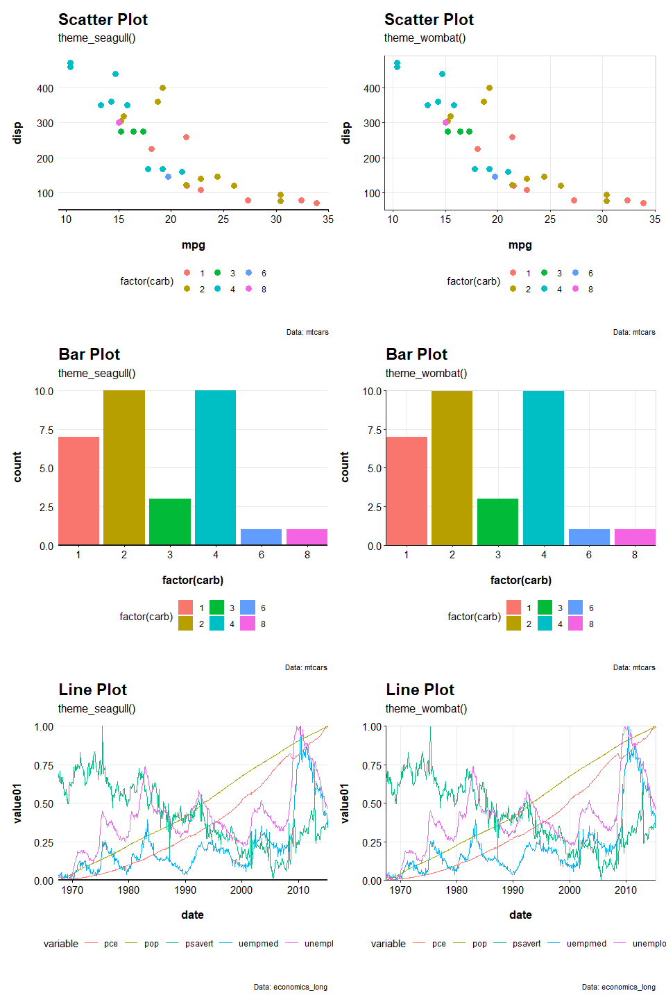
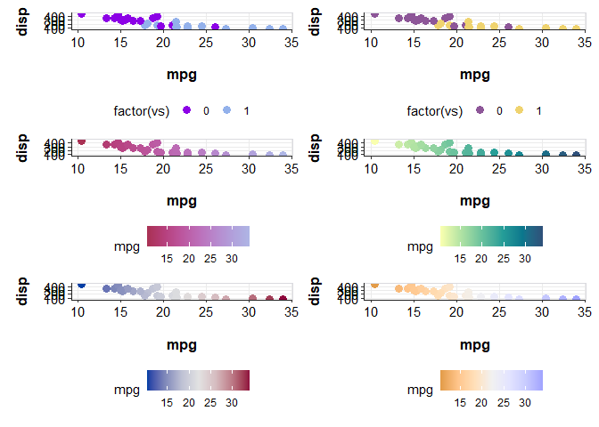

<!-- README.md is generated from README.Rmd. Please edit that file -->

# dataviz

<!-- badges: start -->
<!-- badges: end -->

The goal of `dataviz` is to assist authors of a Multiple Regression
Poststratification edited book in creating visualizations that are
readable, cohesive, and accessible.

## Installation

You can install the `dataviz` package from [GitHub](https://github.com/)
with:

``` r
# install.packages("devtools")
devtools::install_github("j-effendy/dataviz")
```

## Example

These are basic plot examples of `theme_seagull()` and `theme_wombat()`
using `mtcars` and `economics_long` dataset:



These are basic plot examples of `dataviz` colour palettes using
`mtcars` and `economics_long` dataset:


